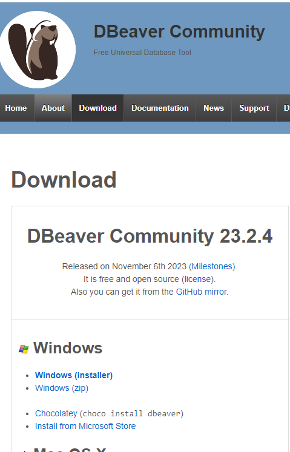
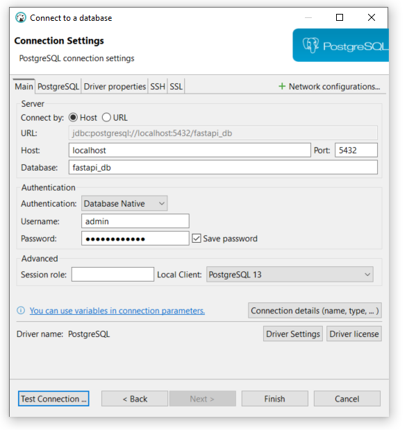

# Fastapi backend

## framework: https://fastapi.tiangolo.com/

## ORM: https://tortoise.github.io/

## migrations: https://github.com/tortoise/aerich

## Database

[https://dbdiagram.io/d/MEO-ASR-64b6b21d02bd1c4a5e48d964]()

## Set up .env file

```bash
cp .env.example .env
```

Edit the new .env file

**Database variables**

postgres_user=admin

postgres_password=Nl^mD-6gXc2B

db_name=fastapi_db

## Starting up the containers

```bash
docker-compose up -d --build
```

## Set up Tortoise ORM

#### No Virtual Environment

```bash
docker-compose exec backend aerich init -t app.database.config.TORTOISE_ORM
docker-compose exec backend aerich init-db
```

#### Virtual Environment

aerich init -t app.database.config.TORTOISE_ORM
aerich init-db

## Migrations

```bash
docker-compose exec backend aerich migrate
docker-compose exec backend aerich upgrade
```

## Setup Dbeaver

#### Download  Dbeaver

https://dbeaver.io/download/



#### Create Connection in Dbeaver



### Validate the Database Scheme


## Setup the Data to the Solution

Go to the Folder solution data-setup and execute the inserts present in **init-data.txt** file in your database


## Run Application

### Validate in Docker if is running:

`docker ps`


### Web Browser

[http://127.0.0.1:2000/docs]()


### Get template File Book

#### Examples Inputs:

```json
{
    "author_name": "Pedro Martins",
    "book_title": "Mastering Python",
}
```
